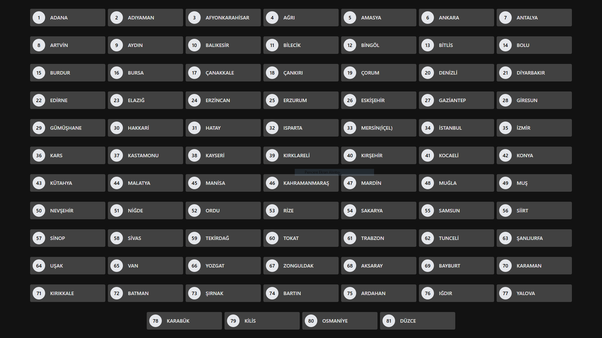
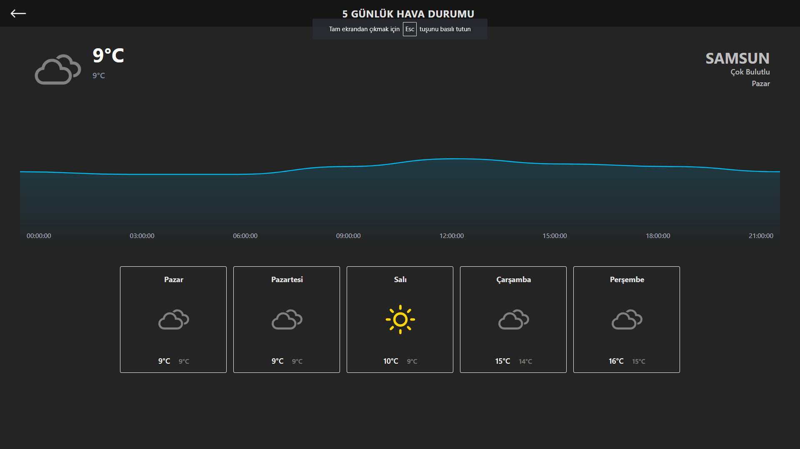

# Hava Durumu Tahmin Uygulaması

Bu, React, Vite ve TailwindCSS ile oluşturulmuş bir hava durumu tahmin uygulamasıdır. Çeşitli şehirler için 5 günlük hava durumu tahmini sağlar.

## Özellikler

- Önümüzdeki 5 gün için hava durumu tahminlerini gösterir.
- Sıcaklık, nem, rüzgar hızı ve daha fazlası dahil olmak üzere ayrıntılı hava durumu koşullarını gösterir.
- Gün içindeki sıcaklık değişimlerini görselleştirmek için etkileşimli grafikler.
- Kolay gezinme ile birden fazla şehri destekler.

## Kullanılan Teknolojiler

- **React**: Kullanıcı arayüzleri oluşturmak için bir JavaScript kütüphanesi.
- **Vite**: Modern web projeleri için daha hızlı ve daha hafif bir geliştirme deneyimi sağlamayı amaçlayan bir yapı aracı.
- **TailwindCSS**: Özel kullanıcı arayüzleri oluşturmak için bir yardımcı sınıf CSS çerçevesi.
- **date-fns**: Modern bir JavaScript tarih yardımcı kütüphanesi.
- **weather-icons-react**: React için bir hava durumu ikonları koleksiyonu.
- **webrix**: React kancaları ve yardımcı programlar kütüphanesi.

## Başlarken

### Gereksinimler

- Node.js (sürüm 14 veya üstü)
- npm (sürüm 6 veya üstü)

### Kurulum

1. Depoyu klonlayın:
   ```sh
   git clone https://github.com/yusufdere55/weatherforecast.git
   cd weatherforecast
   ```

2. Bağımlılıkları yükleyin:
   ```sh
   npm install
   ```

### Uygulamayı Çalıştırma

Geliştirme sunucusunu başlatmak için:
```sh
npm run dev
```

Uygulama `http://localhost:3000` adresinde kullanılabilir olacaktır.

### Üretim İçin Derleme

Uygulamayı üretim için derlemek için:
```sh
npm run build
```

Üretime hazır dosyalar `dist` dizininde olacaktır.

### Kod Kontrolü

Kodu kontrol etmek için:
```sh
npm run lint
```

### Üretim Derlemesini Önizleme

Üretim derlemesini önizlemek için:
```sh
npm run preview
```

## Proje Yapısı

- `src/`: Uygulamanın kaynak kodlarını içerir.
  - `assets/`: Görseller ve veri dosyaları gibi statik varlıkları içerir.
  - `components/`: Yeniden kullanılabilir React bileşenlerini içerir.
  - `pages/`: Uygulamanın ana sayfalarını içerir.
  - `styles/`: Genel stilleri ve TailwindCSS yapılandırmasını içerir.
- `public/`: Genel varlıkları ve ana HTML dosyasını içerir.
- `vite.config.js`: Vite yapılandırma dosyası.
- `package.json`: Proje meta verilerini ve bağımlılıkları içerir.

## Katkıda Bulunma

Katkılar memnuniyetle karşılanır! Herhangi bir iyileştirme veya hata düzeltmesi için lütfen bir sorun açın veya bir çekme isteği gönderin.

## Ekran Görüntüleri

### Ana Sayfa


### Şehir Detayları

